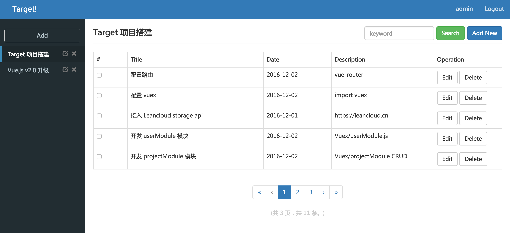
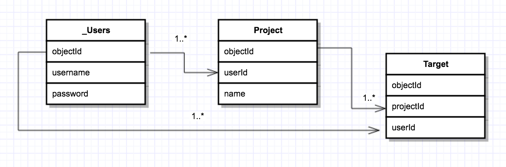
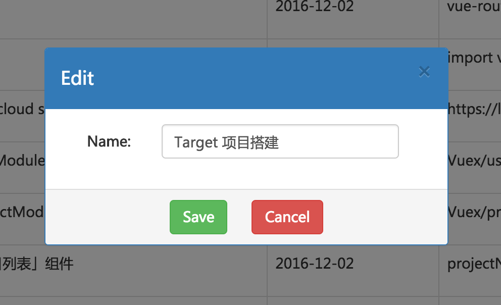
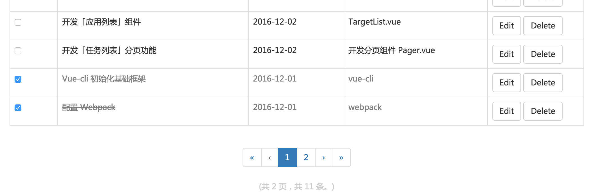

# Target! - A Vue.js todolist

[](https://greenkeeper.io/)



# Based on
- Vue.js v2.x
- Vuex v2.x
- Vue-Router v2.x
- Webpack v1.x
- LeanCloud Storage

# Install
```javascript
git clone https://github.com/monopieces/vuex-leancloud-todo.git
npm install
npm run dev
```

## LeanCloud Storage CRUD
- ERD
>
- Add Project
```js
/**
 * @src vuex/modules/projectModule.js
 */
addProjectAction({ dispatch, commit, state }, preload) {
    // 关联 Project 和 _User 表
    var project = new Lean.Object('Project')
    var _userId = preload.userId
    var userId = Lean.Object.createWithoutData('_User', _userId)
    project.set('userId', userId)
    project.set('isDel', 0)
    Object.keys(preload).forEach(function(key) {
        project.set(key, preload[key])
    })
    project.save().then(function (result) {
        return dispatch('getProjectListAction', _userId)
    }, function(error) {
        console.log('error:', error)
    })
}
```
- Edit Project
```js
/**
 * @src vuex/modules/projectModule.js
 */
updateProjectAction({ dispatch, commit, state }, preload) {
    var project = Lean.Object.createWithoutData('Project', preload.id)
    Object.keys(preload).forEach(function(key) {
        if(key !== 'user' && key !== 'userId') {
            project.set(key, preload[key])
        }
    })
    project.save().then(function() {
        return dispatch('getProjectListAction', preload.userId)
    }, function() {
        console.log('error')
    })
}
```
- Search Target
```js
/**
 * @src vuex/modules/projectModule.js
 */
getTargetListAction({ commit, state }, preload) {
    // 关联 Project 和 _User 表
    var projectId = Lean.Object.createWithoutData('Project', preload.projectId)
    var userId = Lean.Object.createWithoutData('_User', preload.userId)
    var query = new Lean.Query('Target')
    // ... 添加查询条件
    if(preload.keyword) {
        query.contains('title', preload.keyword)
    }
    query.find().then(function(result) {
        commit(GET_TARGET_LIST, result)
    }, function(error) {
        console.log('error:', error)
    })
    // 统计结果
    query.count().then(function(count) {
        if(count) {
            commit(GET_TARGET_LIST_COUNT, count)
        }
    })
}
```

## Compoent
- Modal.vue
>

- Pager.vue
>

- ScrollTop.vue
>
